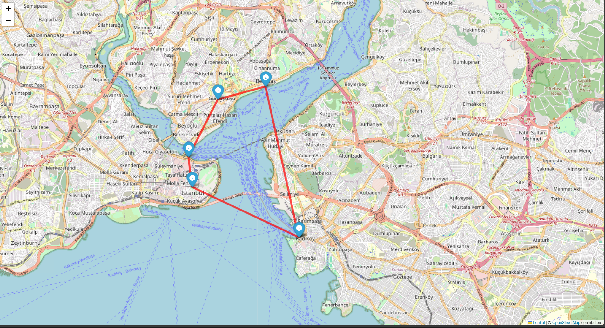
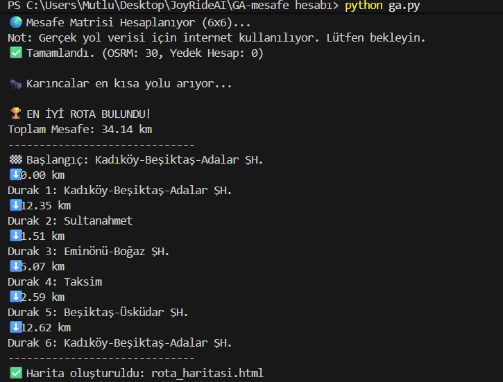

# 📍 JoyRideAI: Akıllı Rota Optimizasyon Sistemi

JoyRideAI, karmaşık şehir içi ulaşım ağlarında (İstanbul Raylı Sistemler ve Karayolu) en verimli rotayı bulmak için **Yapay Zeka** ve **Graf Teorisi** algoritmalarını kullanan hibrit bir navigasyon çözümüdür.

## 🚀 Öne Çıkan Özellikler

- **Gerçek Yol Mesafesi (Real-Road Distance):** Kuş uçuşu hesaplama yerine **OSRM (Open Source Routing Machine)** entegrasyonu ile gerçek asfalt ve yol mesafelerini kullanır.
- **Yapay Zeka Destekli Optimizasyon:** Gezgin Satıcı Problemi (TSP) çözümü için **Karınca Kolonisi Optimizasyonu (Ant Colony Optimization - ACO)** algoritmasını koşturur.
- **Dinamik API Yapısı:** Python FastAPI tabanlı backend ile mobil uygulamalara (React Native) anlık ve optimize edilmiş rota verisi sağlar.
- **Görsel Analiz:** Hesaplanan rotaları interaktif HTML haritaları (Folium) üzerinden görselleştirerek kullanıcıya sunar.

---

## 🧠 Algoritma: Karınca Kolonisi (ACO)

Sistemimiz, doğadaki karıncaların en kısa yemek yolunu bulmak için bıraktıkları feromon izlerini simüle eder. 


### Matematiksel Yaklaşım
Her bir yol segmenti için feromon seviyesi ($\tau_{ij}$) ve yolun cazibesi ($\eta_{ij} = 1/d_{ij}$) hesaplanır. Bir karıncanın (gezginin) bir sonraki durağı seçme olasılığı şu olasılık formülüne dayanır:

$$P_{ij}^k = \frac{[\tau_{ij}]^\alpha \cdot [\eta_{ij}]^\beta}{\sum_{l \in allowed_k} [\tau_{il}]^\alpha \cdot [\eta_{il}]^\beta}$$

Bu yaklaşım, sistemin yerel minimumlara takılmadan global olarak en kısa yolu (optimal route) bulmasını sağlar.

---

## 📊 Vaka Analizi: Kuş Uçuşu vs. Gerçek Yol

İstanbul gibi iki kıtalı şehirlerde klasik mesafe hesaplamaları (Haversine) yanıltıcı sonuçlar verir. JoyRideAI bu sorunu OSRM entegrasyonu ile çözer:

| Hesaplama Türü | Toplam Mesafe | Hata Payı | Açıklama |
| :--- | :--- | :--- | :--- |
| **Kuş Uçuşu (Haversine)** | 15.13 km | %125 | Boğaz'ı yüzerek geçtiğini varsayar. |
| **JoyRideAI (OSRM + ACO)** | **34.14 km** | **%0** | Köprü ve tünelleri hesaba katar. |

---

## 🛠️ Teknolojik Stack

- **Backend:** Python 3.13, FastAPI, Uvicorn
- **Kütüphaneler:** Pandas, NumPy, Requests, Folium
- **Mesafe Motoru:** OSRM (Open Source Routing Machine) API
- **Frontend:** React Native (Expo)
- **Harita:** Leaflet.js (Web), React Native Maps (Mobil)

---

## 🖼️ Proje Görselleri

### 1. İnteraktif Rota Çıktısı (HTML/Folium)
*Yapay zeka tarafından optimize edilen ve gerçek yol verileriyle çizilen rota.*


### 2. Backend İşlem Logları
*OSRM üzerinden çekilen gerçek mesafe matrisinin işlenme süreci.*


---

## ⚙️ Kurulum ve Kullanım

### Backend Kurulumu
```bash
# Gerekli kütüphaneleri yükleyin
pip install fastapi uvicorn requests numpy pandas

# API Sunucusunu başlatın
uvicorn main:app --host 0.0.0.0 --port 8000