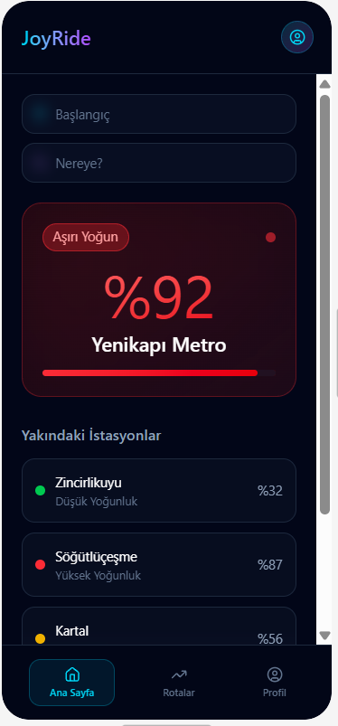
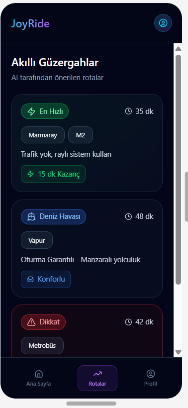
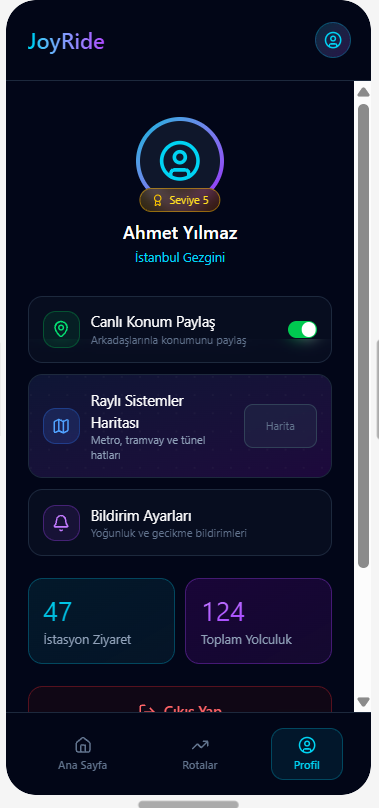

# 🚀 JoyRide - Akıllı İstanbul Ulaşım Rehberi

**JoyRide**, İstanbul'un dinamik ve yoğun ulaşım ağında kullanıcılarına sadece bir rota değil, **zaman ve konfor** kazandıran, yapay zeka destekli bir mobil asistan simülasyonudur.

---

## 🌟 Projenin Amacı
İstanbul gibi metropollerde yoğunluk sadece bir veri değil, bir yaşam kalitesi sorunudur. JoyRide;
* **Dinamik Veri Analizi:** İstasyonlardaki anlık yoğunlukları gerçekçi bir şekilde simüle eder.
* **Akıllı Rota Planlama:** "En kısa yol" yerine, trafik ve kalabalık faktörlerini hesaplayarak "En Mantıklı" rotayı sunar.
* **İstanbul Hackleri:** Metrobüs yerine Marmaray, trafik yerine vapur gibi "İstanbul'u bilen" alternatifler önerir.

---

## 📸 Uygulama Ekran Görüntüleri

Aşağıdaki görseller uygulamanın temel akışını temsil etmektedir:

| 1. Yolculuk Planlama | 2. AI Rota Önerileri | 3. İnteraktif Harita | 4. Kullanıcı Profili |
|:---:|:---:|:---:|:---:|
|  |  |  |
| *Nereden-Nereye planlama ve anlık %92 yoğunluk uyarısı.* | *Yoğunluktan kaçış için AI destekli alternatifler.* | *Tüm İstanbul Raylı Sistem şemasına hızlı erişim.* | *Canlı konum ayarları ve kişiselleştirilmiş panel.* |

---

## 🧠 Akıllı Rota Algoritması (Genetik Algoritma Simülasyonu)
Uygulamanın kalbinde, backend eksikliğini profesyonelce kapatan bir **Mock Logic** katmanı bulunur. Bu katman şunları yapar:
1.  **İstasyon Tanıma:** Yenikapı, Söğütlüçeşme, Zincirlikuyu gibi kritik düğüm noktalarını tanır ve bu noktalardaki aktarma imkanlarını bilir.
2.  **Senaryo Bazlı Çözüm:** Eğer başlangıç durağı %80 üzeri yoğunsa, algoritma otomatik olarak "Deniz Yolu" veya "Ters Yön" taktiklerini devreye sokar.
3.  **Konfor Skoru:** Sadece varış süresini değil, toplu taşıma modunun anlık stres seviyesini (oturma ihtimali, kalabalık düzeyi) puanlar.

---

## 🛠️ Teknik Stack

* **Frontend:** React Native (Expo)
* **Navigasyon:** React Navigation (Native Stack)
* **İkon Seti:** Expo Vector Icons (Ionicons)
* **Tasarım Dili:** Dark Mode Aesthetic, Cyberpunk City Accents
* **Mantıksal Katman:** JavaScript tabanlı "Smart Route" simülasyonu

---

## 📂 Proje Mimarisi

```text
joyride-mobile/
├── assets/             # Uygulama içi görseller ve ikonlar
├── src/
│   ├── screens/
│   │   ├── HomeScreen.js      # Planlama ve yoğunluk analizi
│   │   ├── RouteScreen.js     # AI optimizasyonlu rota listesi
│   │   ├── MapScreen.js       # Raylı sistemler görsel rehberi
│   │   ├── ProfileScreen.js   # Konum ve kullanıcı yönetimi
│   │   └── DetailScreen.js    # İstasyon spesifik analizler
│   └── utils/
│       └── mockBackend.js     # İstanbul durak DB ve akıllı algoritma
├── App.js                     # Navigasyon ve Stack yönetimi
└── package.json               # Bağımlılıklar

## 🚀 Kurulum ve Test

Projeyi yerel ortamınızda denemek için:

### Bağımlılıkları yükleyin
```bash
npm install

### Ön Belleği Temizleyerek Başlayın
 ```bash
 npx expo start -c

*Terminalde oluşan QR kodu, Expo Go uygulaması ile taratın.

JoyRide, Hackathon 2025 kapsamında Bilgisayar Mühendisliği vizyonuyla geliştirilmiştir. 🚇✨
